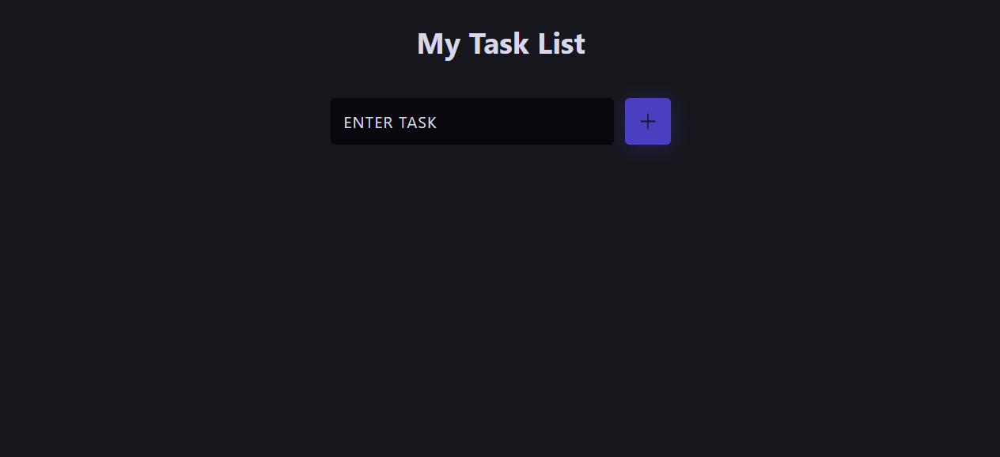
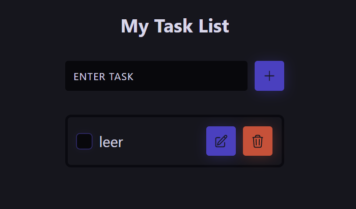
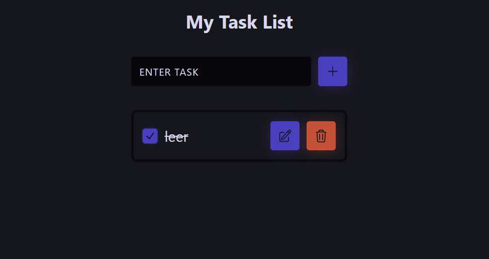
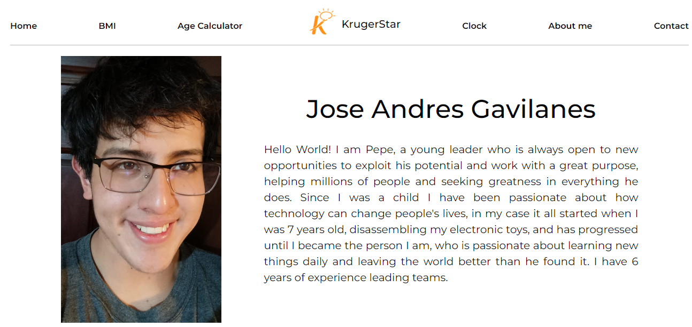
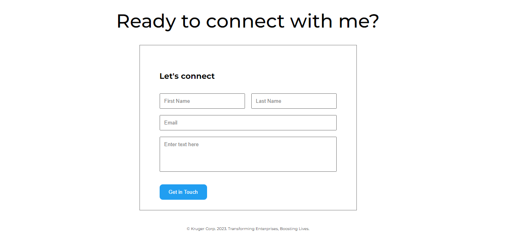

<div align="center">
  
  
</div>

<h1 align="center">
    Playground Kruger
</h1>

<p align="center">
  <a href="#about-the-project">About The Project</a> |
  <a href="#layout">Layout</a> |
  <a href="#technologies">Technologies</a> |
  <a href="#contribution">Contribution</a> |
  <a href="#author">Author</a> |
  <a href="#license">License</a>
</p>

<div align="center">
  
</div>

</br>

---

<h4 align="center">
	🚧 Status: Building 🚀  🚧

  <p align="center">https://playground-kruger.vercel.app/</p>

</h4>

---

</br>

<h2 id="about-the-project" > ⏰📈 About The Project </h2>

1. Show all we've done in KrugerStar (React).
2. Show more about ourselves.
3. Show contact info.
4. Show our CSS abilities.

## Next steps:

- [ ] Fix bugs;
- [ ] Dark theme;
- [ ] Full Responsive;

---

## 🚀 Getting Started

First, run the development server:

```bash
# Clone Repository
$ git clone https://github.com/joseandresgavilanes/playground-kruger.git
# Go to server folder
$ cd playground-kruger
# Install Dependencies
$ npm i
# Run Aplication with ViteJS
$ npm run dev
```

---

<h2 id="layout" >🎨  Layout </h2>

### Home



---

### BMI



---

### Age Calculator



---

### Clock


---

### About



---

### Contact



---

<h2 id="technologies"> 🛠 Technologies </h2>

The following tools were used in the construction of the project:

- **[ReactJS](https://reactjs.org)**
- **[Javascript](https://www.javascript.com/)**
- **[ViteJS](https://vitejs.dev/)**
- **[SCSS](https://sass-lang.com/)**

---

<h2 id="contribution"> 💪 Contribution </h2>

Contributions are what make the open source community such an amazing place to be learn, inspire, and create. Any contributions you make are **greatly appreciated**.

1. Fork the Project
2. Create your Feature Branch (`git checkout -b feature/AmazingFeature`)
3. Commit your Changes (`git commit -m 'Add some AmazingFeature'`)
4. Push to the Branch (`git push origin feature/AmazingFeature`)
5. Open a Pull Request

---

<h2 id="author"> 💻 Author </h2>


<sub><b>José Andrés Gavilanes - Smiley</b></sub></a> <a href="https://www.linkedin.com/in/jose-andres-gavilanes-2954691b5/" title="jose`s linkedin">🚀</a>
<br />
[](https://www.linkedin.com/in/jose-andres-gavilanes-2954691b5/)
[](mailto:joseandresgavilanes2012@gmail.com)

---

<h2 id="license"> 📝 License </h2>
This project is under the [MIT](./LICENSE) license.
